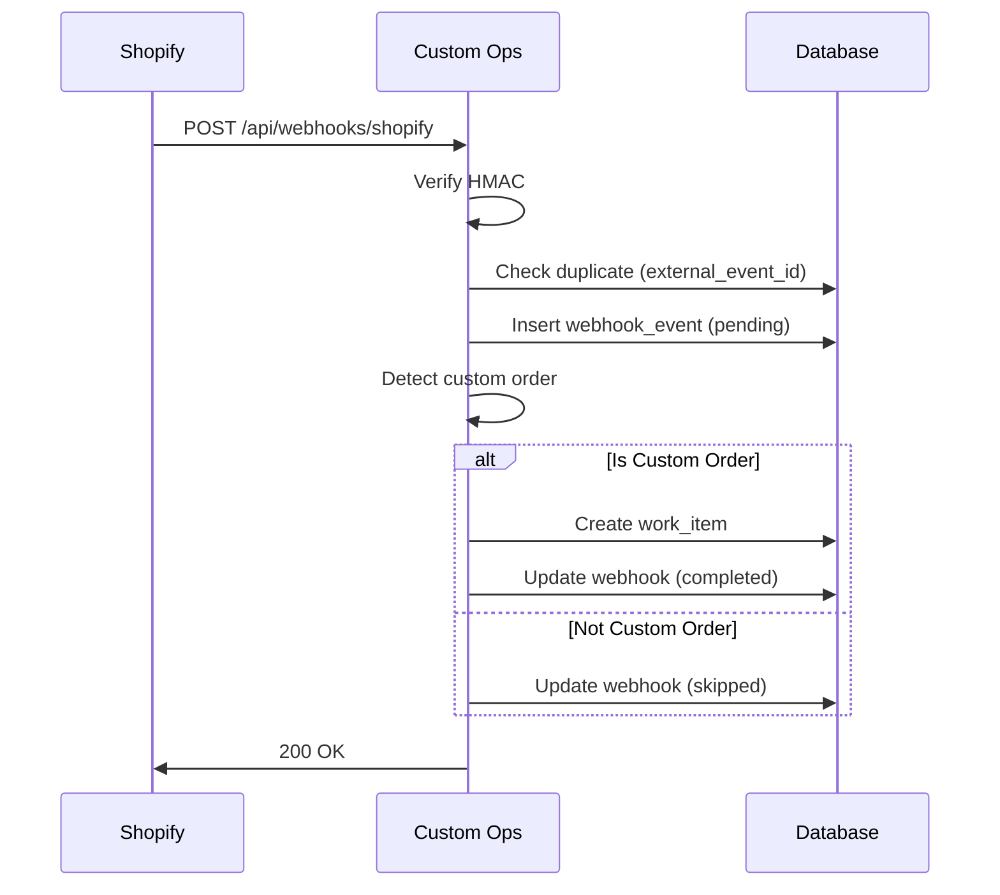

# Custom Ops - Production Readiness Guide

**Version:** 1.0
**Last Updated:** January 27, 2026
**Status:** MVP Complete - Production Hardening In Progress

This document defines operational policies, system of record rules, edge case handling, and technical debt for Custom Ops. These are **intentional decisions**, not oversights.

---

## Table of Contents

1. [System of Record Policies](#1-system-of-record-policies)
2. [Email Ingestion Hardening](#2-email-ingestion-hardening)
3. [Webhook Failure Recovery](#3-webhook-failure-recovery)
4. [Operational Edge Cases](#4-operational-edge-cases)
5. [Technical Debt (Intentional)](#5-technical-debt-intentional)
6. [Change Control Policy](#6-change-control-policy)
7. [Success Criteria & Exit Conditions](#7-success-criteria--exit-conditions)
8. [Bus Factor & Handoff Readiness](#8-bus-factor--handoff-readiness)

---

## 1. System of Record Policies

### **Authoritative Data Sources**

Custom Ops integrates with Shopify and Microsoft 365. This table defines which system is **authoritative** for each data type:

| Data Type | Shopify | Custom Ops | Direction | Notes |
|-----------|---------|------------|-----------|-------|
| **Order creation** | ✅ Authoritative | ❌ Read-only | Shopify → Custom Ops | Orders created in Shopify only |
| **Payment status** | ✅ Authoritative | ❌ Read-only | Shopify → Custom Ops | Never modify payment in Custom Ops |
| **Fulfillment status** | ✅ Authoritative | ❌ Read-only | Shopify → Custom Ops | Fulfillment triggered in Shopify |
| **Design approval status** | ❌ Not tracked | ✅ Authoritative | Custom Ops only | Shopify has no concept of design approval |
| **Follow-up dates** | ❌ Not tracked | ✅ Authoritative | Custom Ops only | Internal operations only |
| **Internal notes** | ❌ Not tracked | ✅ Authoritative | Custom Ops only | Never synced to Shopify |
| **Order tags** | ⚠️ Optional | ❌ Read-only | Shopify → Custom Ops | Read for detection, never write back |
| **Customer email** | ✅ Authoritative | ❌ Read-only | Shopify → Custom Ops | Use Shopify customer record |

### **Write-Back Policy: NONE**

**Decision:** Custom Ops **NEVER** writes data back to Shopify.

**Rationale:**
- Prevents two-way sync conflicts
- Shopify is the ecommerce system of record
- Custom Ops is the operations layer only
- Simplifies integration (one-way only)

**Exception:** None. If you need to update Shopify, do it manually in Shopify admin.

### **Email System of Record**

| Data Type | Microsoft 365 | Custom Ops | Direction |
|-----------|---------------|------------|-----------|
| **Email delivery** | ✅ Authoritative | ❌ Read-only | M365 → Custom Ops |
| **Email content** | ✅ Authoritative | ❌ Read-only | M365 → Custom Ops |
| **Email sending** | ✅ Delivery | ✅ Compose | Custom Ops → M365 |
| **Triage status** | ❌ Not tracked | ✅ Authoritative | Custom Ops only |
| **Work item linking** | ❌ Not tracked | ✅ Authoritative | Custom Ops only |

**Email Sending Flow:**
1. User composes email in Custom Ops
2. Custom Ops calls Microsoft Graph API to send
3. Microsoft 365 delivers email
4. Custom Ops logs communication record

---

## 2. Email Ingestion Hardening

### **Problem: Microsoft Graph Delivers Duplicate Emails**

Microsoft Graph webhooks (when implemented) **will deliver the same email multiple times** due to:
- Network retries
- Service recovery
- Edge case race conditions

### **Solution: Idempotent Email Ingestion**

**Primary Deduplication:**
- `internet_message_id` - Unique constraint enforced
- Microsoft Graph provides this in message metadata
- If duplicate arrives → database INSERT fails → ignore silently

**Fallback Deduplication** (when Message-ID missing):
- Match on: `(from_email, subject, received_at ± 60 seconds)`
- Configured via setting: `email_dedupe_tolerance_seconds = 60`
- Prevents near-duplicate detection for quick replies

**Database Schema:**
```sql
-- Unique constraint prevents duplicate Message-IDs
CREATE UNIQUE INDEX idx_communications_message_id
ON communications(internet_message_id)
WHERE internet_message_id IS NOT NULL;

-- Fallback search index
CREATE INDEX idx_communications_dedupe_fallback
ON communications(from_email, subject, received_at);
```

**Implementation Status:**
- ✅ Database migration created (20260127000004)
- ⚠️ Microsoft Graph webhook not yet implemented
- ⚠️ Deduplication logic not yet in `useCommunications` hook

**TODO for Phase 2:**
- Implement Microsoft Graph webhook subscription
- Add deduplication check in `useCreateCommunication` hook
- Extract `internet_message_id` from Graph API payload

---

## 3. Webhook Failure Recovery

### **Problem: Shopify Webhooks Can Fail**

Shopify webhooks can fail due to:
- Temporary network issues
- Database connection errors
- Invalid data payload
- Server downtime

If a webhook fails silently, **you lose the order forever.**

### **Solution: Reprocessing Pathway**

**Webhook Processing States:**
- `pending` - Webhook received, not yet processed
- `processing` - Currently being processed
- `completed` - Successfully processed
- `failed` - Processing failed (error logged)
- `skipped` - Not a custom order, intentionally ignored

**Retry Mechanism:**
- Manual reprocessing only (no automatic retries)
- Admin can click "Reprocess" button in Webhook Management page
- Maximum 3 retry attempts per webhook
- Retry count and timestamp tracked

**Admin Tooling:**
- Page: `/admin/webhooks`
- Filter by status: All, Failed, Pending, Processing
- View error messages
- One-click reprocess button
- Retry limit prevents infinite loops

**Database Schema:**
```sql
ALTER TABLE webhook_events
ADD COLUMN processing_status TEXT DEFAULT 'pending',
ADD COLUMN processing_error TEXT,
ADD COLUMN processed_at TIMESTAMPTZ,
ADD COLUMN retry_count INTEGER DEFAULT 0,
ADD COLUMN last_retry_at TIMESTAMPTZ;
```

**Implementation Status:**
- ✅ Database migration created
- ✅ Webhook handler updated to track status
- ✅ Admin page created (`/admin/webhooks`)
- ✅ Reprocess API endpoint created (`/api/webhooks/reprocess`)

---

## 4. Operational Edge Cases

### **4.1 Ownership & Accountability Model**

**Rules:**
1. **Default:** Work items are **unassigned** when created
2. **Auto-assignment:** First user to take action on an item is auto-assigned
3. **Manual override:** Admins can reassign to any user
4. **Vacancy handling:** If assigned user leaves, admin must manually reassign

**Settings:**
- `auto_assign_on_first_action = true` (default)

**What counts as "first action"?**
- Creating a lead from email intake
- Approving/rejecting a design
- Sending an email to customer
- Updating status manually

**Database Tracking:**
```sql
ALTER TABLE work_items
ADD COLUMN assigned_to_user_id UUID REFERENCES users(id),
ADD COLUMN auto_assigned BOOLEAN DEFAULT false;
```

**UI Indicators:**
- Auto-assigned items show "(auto)" badge
- Manually assigned show user avatar only

---

### **4.2 "Waiting on Customer" Semantics**

**Status:** `waiting_on_customer`

**Rules:**
1. **Entry:** Manual status change only (user sets this)
2. **Exit:** Automatic when customer replies (detected via `is_customer_response = true`)
3. **Stale threshold:** 14 days (configurable)
4. **Auto-close threshold:** 30 days (configurable, not automatic)

**Settings:**
- `waiting_stale_days = 14`
- `waiting_auto_close_days = 30`

**Behavior:**
- When customer email arrives, check if work item status is `waiting_on_customer`
- If yes, automatically change status to `new_inquiry` or `in_progress`
- Reset `next_follow_up_at` to tomorrow
- Log status event with note: "Customer responded"

**Stale Detection:**
- Items in `waiting_on_customer` for >14 days show yellow warning
- Items in `waiting_on_customer` for >30 days show red alert
- Dashboard shows "Stale Waiting" count
- **No automatic closure** - admin must review and close manually

**Database Schema:**
```sql
ALTER TABLE communications
ADD COLUMN is_customer_response BOOLEAN DEFAULT false,
ADD COLUMN response_to_communication_id UUID REFERENCES communications(id);
```

---

### **4.3 Cancellation & Dead Lead Hygiene**

**Closure Statuses:**
- `closed_won` - Order completed successfully
- `closed_lost` - Customer chose not to proceed
- `closed_event_cancelled` - Customer's event was cancelled

**Rules:**
1. **Who decides:** Admin or assigned user
2. **When:** Manual closure only, no automatic closure
3. **Reason required:** Yes, free-text field required
4. **Criteria:** User judgment (no automatic rules)

**Settings:**
- `closure_reason_required = true`

**Closure Metadata:**
```sql
ALTER TABLE work_items
ADD COLUMN closed_reason TEXT,
ADD COLUMN closed_by_user_id UUID REFERENCES users(id),
ADD COLUMN closed_at TIMESTAMPTZ;
```

**Query Filtering:**
- Closed items **excluded** from all active views by default
- Dashboard counts **exclude** closed items
- Dedicated "Closed Items" archive view available
- Search can optionally include closed items

**Index for Performance:**
```sql
CREATE INDEX idx_work_items_active
ON work_items(status, created_at)
WHERE status NOT IN ('closed_won', 'closed_lost', 'closed_event_cancelled', 'archived');
```

---

## 5. Technical Debt (Intentional)

These are **conscious decisions** to defer complexity, not accidental oversights.

### **5.1 No Background Job Processor**

**Current State:**
- All logic runs at request time
- Server actions for mutations
- No queue worker (no Bullnote, no Inngest, no cron)

**Implications:**
- SLA evaluation is **request-triggered**, not time-triggered
- Follow-up reminders shown when user visits dashboard
- No midnight batch jobs

**Why This Is OK for MVP:**
- Simple deployment (no additional infrastructure)
- Low volume (~25 emails/week, ~100 orders/month)
- Dashboard is checked multiple times daily

**When to revisit:**
- If volume exceeds 1,000 work items
- If SLA violations become frequent
- If automated email reminders are needed

**Documentation:** This is Phase 2 work, not MVP scope.

---

### **5.2 No Full-Text Search**

**Current State:**
- Filtering uses `ILIKE` on customer name, email, order number
- No Postgres full-text search (FTS)
- No Elasticsearch, no Algolia

**Implications:**
- Search is substring match only
- Case-insensitive but not fuzzy
- No relevance ranking

**Why This Is OK for MVP:**
- Small dataset (hundreds of items, not millions)
- Users know customer names or order numbers
- Filters are sufficient for current volume

**When to revisit:**
- If search becomes slow (>2 seconds)
- If users request fuzzy matching
- If dataset exceeds 10,000 work items

**Documentation:** This is intentional simplicity.

---

### **5.3 No File Virus Scanning**

**Current State:**
- Supabase Storage does **not** scan uploaded files for malware
- Internal-only uploads (no public file sharing)

**Implications:**
- Uploaded design files are not scanned
- Trust model: internal users only

**Mitigation:**
- File uploads are from internal staff only (no customer uploads)
- No public file URLs
- No direct downloads from external sources

**Why This Is OK for MVP:**
- Internal team uploads only
- Low risk surface (trusted users)
- Supabase storage is private by default

**When to revisit:**
- If customer uploads are allowed (Phase 3+)
- If compliance requires it (SOC 2, HIPAA, etc.)

**Documentation:** This is a known limitation, not a bug.

---

### **5.4 No Microsoft Graph Email Sending**

**Current State:**
- Email composition UI is complete
- Email records are logged to database
- **Actual sending via Microsoft Graph API is not implemented**

**Placeholder:**
```typescript
// TODO: Actually send via Microsoft Graph API
// For now, just log to database
```

**Why Deferred:**
- MVP focused on workflow visibility first
- Email sending is Phase 1.5 (next immediate priority)
- UI is built, integration is straightforward

**Implementation Path:**
```typescript
// When implementing, add:
import { Client } from '@microsoft/microsoft-graph-client'

const graphClient = Client.init({
  authProvider: (done) => {
    done(null, accessToken)
  },
})

await graphClient.api('/me/sendMail').post({
  message: {
    subject: emailForm.subject,
    body: { contentType: 'HTML', content: emailForm.body },
    toRecipients: [{ emailAddress: { address: emailForm.to } }],
  },
})
```

**Documentation:** This is MVP scope but implementation deferred for velocity.

---

## 6. Change Control Policy

### **Phase 1 Freeze Rules**

Any request that introduces **any of the following** is considered **Phase 2** and requires explicit approval:

❌ **Blocked for Phase 1:**
- New work item statuses
- New work item types (beyond `customify_order` and `assisted_project`)
- New external integrations (beyond Shopify and Microsoft 365)
- Customer-facing functionality (portals, public APIs, etc.)
- New user roles (beyond admin, manager, operator)
- Two-way sync with Shopify (write-back)
- Automated workflow actions (auto-close, auto-assign beyond first action)

✅ **Allowed for Phase 1:**
- Bug fixes
- Performance optimizations
- UI/UX improvements (styling, layout)
- Documentation updates
- Security patches
- Microsoft Graph email sending integration (deferred MVP scope)

### **Request Process**

If a feature request arrives:

1. **Ask:** "Does this introduce new statuses, types, integrations, or customer-facing functionality?"
2. **If yes:** Tag as Phase 2, defer to backlog
3. **If no:** Evaluate as Phase 1 enhancement

### **Rationale**

This prevents **scope creep** and ensures:
- Phase 1 ships on time
- MVP is stable before expansion
- Team learns from real usage before adding complexity

---

## 7. Success Criteria & Exit Conditions

### **Phase 1 Success Metrics**

**Quantitative:**
- ✅ 100% of Shopify custom orders auto-imported
- ✅ 100% of emails triaged within 24 hours
- ✅ 95% of designs reviewed within SLA (<24 hours)
- ✅ Zero lost customer inquiries

**Qualitative:**
- ✅ Team prefers Custom Ops over spreadsheets
- ✅ No "where did that email go?" questions
- ✅ Follow-up dates are reliable
- ✅ Design approval workflow is clear

### **Phase 1 Exit Criteria (Freeze Point)**

Phase 1 is **frozen** when:

1. ✅ All core workflows are operational (email, design queue, work items)
2. ✅ Team has used system for **at least 2 weeks** in production
3. ✅ Webhook integration is stable (no failed webhooks in 1 week)
4. ✅ Email sending via Microsoft Graph is working
5. ✅ No critical bugs reported in 1 week

**Freeze Date:** TBD (estimated 2 weeks after deployment)

### **When Refactoring Is Allowed**

**Blocked during Phase 1:**
- Schema changes (except bug fixes)
- Major architectural changes
- New dependencies

**Allowed during Phase 1:**
- Code cleanup (rename variables, extract functions)
- Performance optimization (indexes, query optimization)
- Type safety improvements

**Allowed after Phase 1 freeze:**
- Schema migrations (with approval)
- New features (via Phase 2 planning)

---

## 8. Bus Factor & Handoff Readiness

**Question:** Could a new developer take this over in 90 days?

**Current State:** Close, but missing a few documentation pieces.

### **8.1 What's Already Documented**

✅ Complete implementation plan (IMPLEMENTATION_PLAN.md)
✅ Setup guide for Supabase (SETUP_GUIDE.md)
✅ Deployment status (DEPLOYMENT_STATUS.md)
✅ Full feature report (this conversation)
✅ Database schema in migrations
✅ Type-safe hooks with inline comments

### **8.2 What's Missing**

❌ **ERD Diagram** - Visual database schema
❌ **Email Matching Logic** - How emails link to work items
❌ **Shopify Detection Logic** - How custom orders are identified
❌ **Webhook Flow Diagram** - Visual flow from Shopify → Custom Ops

### **8.3 Recommended Additions**

#### **ERD Diagram**

Create a Mermaid diagram showing:
- `work_items` as central entity
- Relationships to `communications`, `customers`, `batches`
- Foreign keys and constraints

#### **How Email Matching Works (Prose)**

**Document:** `docs/EMAIL_MATCHING.md`

**Content:**
1. Email arrives via Microsoft Graph webhook
2. Check `internet_message_id` for duplicate
3. Extract `from_email` and parse sender
4. Check if sender matches existing `customers` table
5. If existing customer, find related `work_items`
6. If thread reply, detect via `response_to_communication_id`
7. Attach email to work item
8. If no match, email goes to Untriaged queue

#### **How Shopify Detection Works (Prose)**

**Document:** `docs/SHOPIFY_DETECTION.md`

**Content:**
1. Webhook arrives with order JSON
2. Iterate through `line_items` array
3. Check `properties` for Customify keys:
   - `design_preview`
   - `_design_preview_url`
   - `design_download`
   - `_design_download_url`
4. Check product `title` for keywords: "custom", "customify"
5. Check order `tags` for keywords: "custom", "customify"
6. If **any** match, flag as custom order
7. Create `work_item` with type `customify_order`

#### **Webhook Flow Diagram**

**Visual Mermaid:**


### **8.4 Handoff Checklist**

For a new developer to take over:

- [x] Clone repo and run `npm install`
- [x] Copy `.env.example` to `.env.local`
- [x] Create Supabase project
- [x] Run migrations (SETUP_GUIDE.md)
- [x] Run `npm run dev`
- [ ] Read PRODUCTION_READINESS.md (this file)
- [ ] Read EMAIL_MATCHING.md (to be created)
- [ ] Read SHOPIFY_DETECTION.md (to be created)
- [ ] Review ERD diagram (to be created)
- [ ] Pair with existing developer for 1 session

**Estimated Onboarding Time:** 4-6 hours (with documentation)

---

## Appendix: Key Files Reference

| File | Purpose | Status |
|------|---------|--------|
| `supabase/migrations/20260127000004_production_hardening.sql` | Email deduplication, webhook recovery | ✅ Created |
| `app/api/webhooks/shopify/route.ts` | Shopify webhook handler | ✅ Updated |
| `app/api/webhooks/reprocess/route.ts` | Manual webhook retry | ✅ Created |
| `app/(dashboard)/admin/webhooks/page.tsx` | Webhook management UI | ✅ Created |
| `lib/hooks/use-communications.ts` | Email data access | ⚠️ Needs deduplication logic |
| `PRODUCTION_READINESS.md` | This file | ✅ You're reading it |

---

## Questions?

**For operational policy questions:** Refer to Section 1 (System of Record)
**For technical debt questions:** Refer to Section 5 (Intentional Debt)
**For change requests:** Refer to Section 6 (Change Control Policy)
**For onboarding questions:** Refer to Section 8 (Bus Factor)

---

**Document Version:** 1.0
**Next Review:** After 2 weeks of production usage
**Owner:** Development Team + Operations Manager
