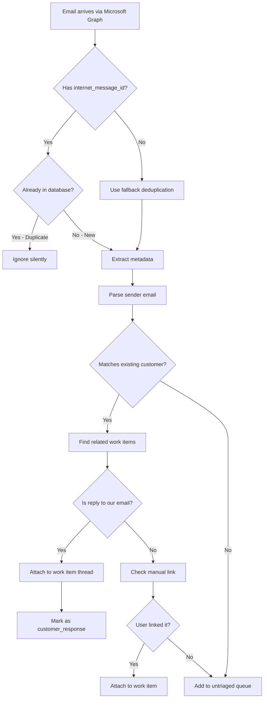

# Email Matching Logic

**Purpose:** Understand how incoming emails are matched to work items and customers.

---

## Overview

Custom Ops receives emails via Microsoft Graph API (when implemented). This document explains:
1. How we prevent duplicate emails
2. How we identify the sender
3. How we link emails to existing work items
4. How we detect reply threads

---

## Email Ingestion Flow



---

## 1. Deduplication

### Primary: Message-ID

**Source:** Microsoft Graph provides `internetMessageId` field

**Example:**
```json
{
  "internetMessageId": "<CAB+wJm4xyzabc123@mail.gmail.com>",
  "subject": "Custom fan order question",
  "from": { "emailAddress": { "address": "customer@example.com" } }
}
```

**Database Check:**
```sql
SELECT id FROM communications
WHERE internet_message_id = '<CAB+wJm4xyzabc123@mail.gmail.com>'
```

**If found:** Email already ingested → ignore
**If not found:** Proceed to insert

### Fallback: Fuzzy Match

When `internetMessageId` is missing (rare edge case):

**Match on:**
- `from_email` (exact match)
- `subject` (exact match)
- `received_at` within ±60 seconds

**SQL:**
```sql
SELECT id FROM communications
WHERE from_email = 'customer@example.com'
  AND subject = 'Custom fan order question'
  AND received_at BETWEEN '2026-01-27 10:00:00' AND '2026-01-27 10:02:00'
```

**Tolerance:** Configured via `settings.email_dedupe_tolerance_seconds` (default: 60)

---

## 2. Sender Identification

### Extract Email Address

**From Microsoft Graph:**
```json
{
  "from": {
    "emailAddress": {
      "name": "John Doe",
      "address": "john@example.com"
    }
  }
}
```

**Parsed to:**
- `from_email`: "john@example.com"
- `from_name`: "John Doe"

### Customer Lookup

**Query:**
```sql
SELECT id, name, email FROM customers
WHERE email = 'john@example.com'
```

**If found:** Link email to customer
**If not found:** Create minimal customer record (email only, no name yet)

---

## 3. Work Item Linking

### Automatic Linking (Reply Detection)

**Scenario:** Customer replies to our email

**Microsoft Graph provides:**
```json
{
  "conversationId": "AAQkAG...",
  "inReplyTo": "<previous-message-id@mail.gmail.com>"
}
```

**Lookup Logic:**
1. Find our original outbound email via `inReplyTo`
2. Get `work_item_id` from that communication record
3. Attach this reply to same work item
4. Set `is_customer_response = true`

**SQL:**
```sql
-- Find original email we sent
SELECT work_item_id FROM communications
WHERE internet_message_id = '<previous-message-id@mail.gmail.com>'
  AND direction = 'outbound'

-- Insert reply with same work_item_id
INSERT INTO communications (
  work_item_id,
  direction,
  from_email,
  is_customer_response,
  response_to_communication_id,
  ...
)
```

### Manual Linking (Triage Action)

**Scenario:** First email from customer (no prior thread)

**Process:**
1. Email appears in **Untriaged Queue** (`/email-intake`)
2. User clicks "Create Lead"
3. New work item created
4. Email's `work_item_id` updated to link it

**SQL:**
```sql
-- Create work item
INSERT INTO work_items (type, source, customer_email, ...)
VALUES ('assisted_project', 'email', 'john@example.com', ...)
RETURNING id

-- Link email to work item
UPDATE communications
SET work_item_id = [new_work_item_id],
    triage_status = 'created_lead'
WHERE id = [email_id]
```

### No Linking (Support Email)

**Scenario:** Customer service question, not a custom order inquiry

**Process:**
1. Email appears in **Untriaged Queue**
2. User clicks "Flag Support"
3. Email routed to **Support Queue** (`/support-queue`)
4. No work item created (yet)

**SQL:**
```sql
UPDATE communications
SET triage_status = 'flagged_support'
WHERE id = [email_id]
```

---

## 4. Reply Thread Detection

### Conversation Threading

**Goal:** Keep all related emails together in work item timeline

**Microsoft Graph Fields:**
- `conversationId` - Groups all emails in thread
- `inReplyTo` - Parent message ID
- `references` - Chain of previous message IDs

**Our Tracking:**
```sql
ALTER TABLE communications
ADD COLUMN is_customer_response BOOLEAN DEFAULT false,
ADD COLUMN response_to_communication_id UUID REFERENCES communications(id);
```

**Example Thread:**
1. **Us:** "Hi John, here's your design preview" (outbound)
   - `work_item_id = 123`
   - `direction = 'outbound'`
   - `internet_message_id = '<msg-001>'`

2. **Customer:** "Looks great, please proceed!" (inbound reply)
   - `work_item_id = 123` (inherited)
   - `direction = 'inbound'`
   - `is_customer_response = true`
   - `response_to_communication_id = [msg-001 ID]`
   - `internet_message_id = '<msg-002>'`

3. **Us:** "Perfect! We'll ship next week" (outbound reply)
   - `work_item_id = 123` (same thread)
   - `direction = 'outbound'`
   - `response_to_communication_id = [msg-002 ID]`

### "Waiting on Customer" Auto-Exit

**Trigger:** Customer reply while work item status is `waiting_on_customer`

**Logic:**
```typescript
// When ingesting reply
if (email.is_customer_response && workItem.status === 'waiting_on_customer') {
  await updateWorkItemStatus({
    id: workItem.id,
    status: 'in_progress',
    note: 'Customer responded - auto-exiting waiting status',
  })

  await updateWorkItem({
    id: workItem.id,
    next_follow_up_at: addDays(new Date(), 1), // Tomorrow
  })
}
```

---

## 5. Edge Cases

### Case 1: Customer Uses Different Email Address

**Problem:** John sends from john@gmail.com, we reply, he responds from john@work.com

**Behavior:**
- Reply won't auto-link (different sender)
- Appears in Untriaged Queue
- User must manually attach to existing work item

**Future Enhancement:** Name matching + fuzzy logic

### Case 2: Email Arrives Before Webhook

**Scenario:** Customer emails about Shopify order before webhook creates work item

**Behavior:**
- Email goes to Untriaged Queue
- User creates lead manually
- When webhook arrives later, duplicate work item created (different `shopify_order_id`)

**Workaround:** User merges manually (Phase 2 feature)

### Case 3: Mass Email / Newsletter

**Problem:** Customer sends mass email including us in BCC

**Behavior:**
- Email ingested normally
- No reply detection (not a direct reply)
- Goes to Untriaged Queue
- User triages as "Archive" or "Support"

**No automatic filtering** - manual review required

### Case 4: Email Arrives Out of Order

**Problem:** Network delays cause reply to arrive before original

**Behavior:**
- Reply arrives first → `inReplyTo` points to non-existent message
- Goes to Untriaged Queue (no auto-link possible)
- Original arrives later → links correctly
- Reply remains orphaned until user manually links

**Future Enhancement:** Background job to retry orphaned replies

---

## 6. Data Model

### `communications` Table

```sql
CREATE TABLE communications (
  id UUID PRIMARY KEY,
  work_item_id UUID REFERENCES work_items(id),  -- NULL until triaged

  -- Deduplication
  internet_message_id TEXT,  -- Microsoft Graph Message-ID

  -- Sender/Recipient
  direction TEXT,  -- 'inbound' or 'outbound'
  from_email TEXT,
  to_emails TEXT[],

  -- Threading
  is_customer_response BOOLEAN DEFAULT false,
  response_to_communication_id UUID REFERENCES communications(id),

  -- Triage
  triage_status TEXT,  -- 'untriaged', 'created_lead', 'flagged_support', 'archived'

  -- Content
  subject TEXT,
  body_html TEXT,
  body_preview TEXT,

  -- Timestamps
  received_at TIMESTAMPTZ,
  sent_at TIMESTAMPTZ,
  created_at TIMESTAMPTZ DEFAULT now()
);

-- Indexes
CREATE UNIQUE INDEX idx_communications_message_id
ON communications(internet_message_id)
WHERE internet_message_id IS NOT NULL;

CREATE INDEX idx_communications_dedupe_fallback
ON communications(from_email, subject, received_at);

CREATE INDEX idx_communications_customer_responses
ON communications(work_item_id, is_customer_response, received_at)
WHERE is_customer_response = true;
```

---

## 7. Implementation Status

| Feature | Status | File |
|---------|--------|------|
| **Deduplication schema** | ✅ Complete | `migrations/20260127000004_production_hardening.sql` |
| **Customer lookup** | ⚠️ Placeholder | `lib/hooks/use-communications.ts` |
| **Reply detection** | ⚠️ Not implemented | TBD |
| **Auto-exit waiting status** | ⚠️ Not implemented | TBD |
| **Microsoft Graph webhook** | ❌ Not started | Phase 1.5 |

**Next Steps:**
1. Implement Microsoft Graph webhook subscription
2. Add deduplication check in `useCreateCommunication` hook
3. Implement reply thread detection
4. Test with real email threads

---

## Questions?

**"How do I link an email to a work item?"**
→ Go to Email Intake Queue, click "Create Lead" or attach to existing

**"Why isn't the reply auto-linking?"**
→ Check if `internet_message_id` and `inReplyTo` are populated correctly

**"Can I merge duplicate work items?"**
→ Not in Phase 1 - manual workaround: close one, note in other

**"What if customer changes email address?"**
→ Manual link required - Phase 2 will add fuzzy matching

---

**Last Updated:** January 27, 2026
**Maintained By:** Development Team
