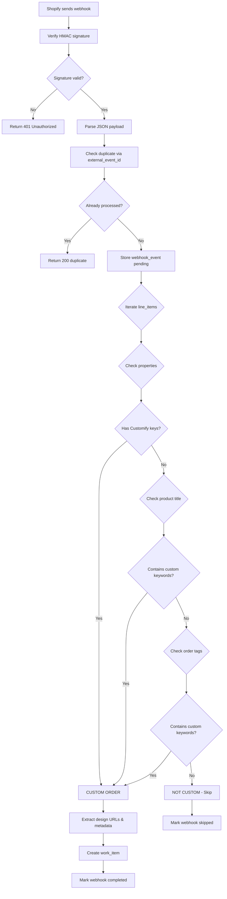

# Shopify Custom Order Detection Logic

**Purpose:** Understand how the system identifies which Shopify orders are custom fan orders requiring design review.

---

## Overview

Not every Shopify order is a custom order. Most orders are regular products (standard fans, apparel, etc.).

**This document explains:**
1. How webhooks arrive from Shopify
2. How we detect custom orders
3. What data we extract
4. Edge cases and failure modes

---

## Detection Flow



---

## 1. Webhook Reception

### Shopify Webhook Topics

Custom Ops subscribes to:
- `orders/create` - New order placed
- `orders/updated` - Order modified (payment, tags, etc.)
- `fulfillments/create` - Order shipped
- `orders/fulfilled` - Order fully fulfilled

### HMAC Verification

**Security:** Shopify signs webhooks with HMAC-SHA256

**Verification Code:**
```typescript
const secret = process.env.SHOPIFY_WEBHOOK_SECRET
const hmac = headers.get('x-shopify-hmac-sha256')

const hash = crypto
  .createHmac('sha256', secret)
  .update(body, 'utf8')
  .digest('base64')

if (hash !== hmac) {
  return NextResponse.json({ error: 'Invalid HMAC' }, { status: 401 })
}
```

**If verification fails:** Webhook is rejected (potential security attack)

---

## 2. Detection Rules

### Rule 1: Customify Line Item Properties

**Primary Detection:** Customify adds custom properties to line items

**Example Shopify Order JSON:**
```json
{
  "id": 5993599295690,
  "line_items": [
    {
      "title": "Custom Pride Fan",
      "quantity": 2,
      "properties": [
        {
          "name": "_design_preview_url",
          "value": "https://customify.app/previews/abc123.png"
        },
        {
          "name": "_design_download_url",
          "value": "https://customify.app/downloads/abc123.pdf"
        },
        {
          "name": "grip_color",
          "value": "Rainbow"
        }
      ]
    }
  ]
}
```

**Detection Code:**
```typescript
for (const item of order.line_items || []) {
  if (item.properties) {
    const props = Array.isArray(item.properties) ? item.properties : []
    for (const prop of props) {
      if (
        prop.name === 'design_preview' ||
        prop.name === '_design_preview_url' ||
        prop.name === 'design_download' ||
        prop.name === '_design_download_url' ||
        prop.name.toLowerCase().includes('customify')
      ) {
        return true  // CUSTOM ORDER DETECTED
      }
    }
  }
}
```

**Keywords Checked:**
- `design_preview`
- `_design_preview_url`
- `design_download`
- `_design_download_url`
- Any property name containing `customify`

---

### Rule 2: Product Title Keywords

**Fallback Detection:** Product name contains "custom"

**Example:**
```json
{
  "line_items": [
    {
      "title": "Custom Pride Fan - Personalized",
      "quantity": 1
    }
  ]
}
```

**Detection Code:**
```typescript
if (
  item.title?.toLowerCase().includes('custom') ||
  item.title?.toLowerCase().includes('customify')
) {
  return true  // CUSTOM ORDER DETECTED
}
```

**Keywords:**
- `custom` (case-insensitive)
- `customify` (case-insensitive)

**Why this matters:** If Customify integration fails, manual products might still have "Custom" in title

---

### Rule 3: Order Tags

**Secondary Detection:** Shopify staff can manually tag orders

**Example:**
```json
{
  "tags": "custom, pride-festival, rush-order"
}
```

**Detection Code:**
```typescript
const tags = order.tags?.toLowerCase() || ''
if (tags.includes('custom') || tags.includes('customify')) {
  return true  // CUSTOM ORDER DETECTED
}
```

**Keywords:**
- `custom`
- `customify`

**Why this matters:** Manual fallback if automation fails

---

## 3. Data Extraction

Once a custom order is detected, extract metadata:

### Design URLs

**From Line Item Properties:**
```typescript
let designPreviewUrl = null
let designDownloadUrl = null

for (const item of order.line_items || []) {
  if (item.properties) {
    const props = Array.isArray(item.properties) ? item.properties : []
    for (const prop of props) {
      if (prop.name === 'design_preview' || prop.name === '_design_preview_url') {
        designPreviewUrl = prop.value
      }
      if (prop.name === 'design_download' || prop.name === '_design_download_url') {
        designDownloadUrl = prop.value
      }
    }
  }
}
```

**Stored in:**
- `work_items.design_preview_url` - Image for visual review
- `work_items.design_download_url` - Production-ready file

### Quantity

**Sum of all line items:**
```typescript
let quantity = 0
for (const item of order.line_items || []) {
  quantity += item.quantity
}
```

**Example:**
- Line 1: 10 fans
- Line 2: 5 fans
- Total: 15 fans

### Grip Color

**From Line Item Properties:**
```typescript
let gripColor = null
for (const prop of props) {
  if (prop.name === 'grip_color' || prop.name === 'Grip Color') {
    gripColor = prop.value
  }
}
```

**Common Values:**
- "Rainbow"
- "Black"
- "White"
- "Gold"

### Customer Information

**From Order Object:**
```typescript
customer_name: order.customer
  ? `${order.customer.first_name || ''} ${order.customer.last_name || ''}`.trim()
  : null,
customer_email: order.customer?.email,
```

**Example:**
```json
{
  "customer": {
    "first_name": "Alex",
    "last_name": "Rivera",
    "email": "alex@example.com"
  }
}
```

### Shopify Metadata

**From Order Object:**
```typescript
shopify_order_id: order.id.toString(),
shopify_order_number: order.name,  // e.g. "#1234"
shopify_financial_status: order.financial_status,  // "paid", "pending"
shopify_fulfillment_status: order.fulfillment_status,  // null, "fulfilled"
```

---

## 4. Work Item Creation

**SQL Insert:**
```sql
INSERT INTO work_items (
  type,
  source,
  status,
  shopify_order_id,
  shopify_order_number,
  shopify_financial_status,
  shopify_fulfillment_status,
  customer_name,
  customer_email,
  quantity,
  grip_color,
  design_preview_url,
  design_download_url,
  reason_included
) VALUES (
  'customify_order',
  'shopify',
  'needs_design_review',
  '5993599295690',
  '#10234',
  'paid',
  null,
  'Alex Rivera',
  'alex@example.com',
  15,
  'Rainbow',
  'https://customify.app/previews/abc123.png',
  'https://customify.app/downloads/abc123.pdf',
  '{
    "detected_via": "shopify_webhook",
    "order_tags": "custom, pride-festival",
    "has_customify_properties": true
  }'
)
```

**Key Fields:**
- `type`: Always `customify_order` for Shopify
- `source`: Always `shopify`
- `status`: Always `needs_design_review` initially
- `reason_included`: JSON audit trail of detection logic

---

## 5. Edge Cases

### Case 1: Order Has Both Custom and Regular Items

**Example:**
- Line 1: Custom Pride Fan (Customify)
- Line 2: Standard Rainbow T-Shirt

**Behavior:**
- Entire order flagged as custom
- Work item created for entire order
- Quantity includes all items

**Why:** Simpler logic, avoids partial order tracking

**Future:** Phase 2 might split orders

### Case 2: Customify Integration Breaks

**Scenario:** Customify stops adding properties

**Fallback:**
1. Product title check: "Custom Pride Fan"
2. Manual tag: Staff adds "custom" tag in Shopify
3. If neither, order is missed

**Mitigation:**
- Monitor for orders with "custom" in title but no properties
- Alert if detection rate drops

### Case 3: Duplicate Webhook Delivery

**Problem:** Shopify retries webhooks on network issues

**Solution:**
```typescript
const { data: existingEvent } = await supabase
  .from('webhook_events')
  .select('id, processing_status')
  .eq('provider', 'shopify')
  .eq('external_event_id', order.id.toString())
  .single()

if (existingEvent && existingEvent.processing_status === 'completed') {
  return NextResponse.json({ received: true, status: 'duplicate_processed' })
}
```

**Idempotency:** Same `external_event_id` = same order = ignore duplicate

### Case 4: Order Updated After Creation

**Scenario:**
1. Webhook 1: `orders/create` → Work item created
2. Webhook 2: `orders/updated` (tags changed) → No duplicate work item

**Detection:**
```sql
SELECT id FROM work_items
WHERE shopify_order_id = '5993599295690'
```

**Behavior:**
- If work item exists: Update `shopify_financial_status`, `shopify_fulfillment_status`
- If not exists: Create new (shouldn't happen if create webhook succeeded)

### Case 5: Non-Custom Order

**Example:**
```json
{
  "line_items": [
    {
      "title": "Standard Rainbow Flag",
      "quantity": 1,
      "properties": []
    }
  ],
  "tags": ""
}
```

**Behavior:**
- Detection fails (no Customify properties, no keywords)
- Webhook marked as `skipped`
- No work item created
- Logged for debugging:
  ```sql
  UPDATE webhook_events
  SET processing_status = 'completed',
      processing_error = 'Not a custom order - no work item created'
  WHERE id = [webhook_id]
  ```

---

## 6. Testing the Detection

### Test Payload (Custom Order)

```json
{
  "id": 5993599295690,
  "name": "#10234",
  "email": "alex@example.com",
  "financial_status": "paid",
  "fulfillment_status": null,
  "customer": {
    "first_name": "Alex",
    "last_name": "Rivera",
    "email": "alex@example.com"
  },
  "line_items": [
    {
      "title": "Custom Pride Fan",
      "quantity": 10,
      "properties": [
        { "name": "_design_preview_url", "value": "https://customify.app/preview.png" },
        { "name": "_design_download_url", "value": "https://customify.app/design.pdf" },
        { "name": "grip_color", "value": "Rainbow" }
      ]
    }
  ],
  "tags": "custom, pride"
}
```

**Expected:**
- ✅ Detected as custom order
- ✅ Work item created
- ✅ Design URLs extracted
- ✅ Webhook marked `completed`

### Test Payload (Non-Custom Order)

```json
{
  "id": 5993599295691,
  "name": "#10235",
  "line_items": [
    {
      "title": "Standard Rainbow T-Shirt",
      "quantity": 2,
      "properties": []
    }
  ],
  "tags": ""
}
```

**Expected:**
- ✅ Not detected as custom
- ✅ No work item created
- ✅ Webhook marked `completed` with note "Not a custom order"

---

## 7. Monitoring Detection Accuracy

### Metrics to Track

**Via Admin Webhook Page (`/admin/webhooks`):**

**Good Signs:**
- Most webhooks marked `completed`
- Few webhooks marked `failed`
- `skipped` count = non-custom orders (normal)

**Warning Signs:**
- High `failed` count → investigation needed
- No custom orders for 7+ days → Customify broken?
- All orders `skipped` → detection logic broken?

### Manual Verification

**Weekly Check:**
1. Go to Shopify Orders
2. Filter by tag `custom`
3. Count custom orders
4. Compare to work items created this week
5. Should match within 5%

**If mismatch:**
- Check Customify integration in Shopify
- Review detection logic
- Check for failed webhooks

---

## 8. Code Location

| File | Function | Line |
|------|----------|------|
| `app/api/webhooks/shopify/route.ts` | Main webhook handler | 9-63 |
| `app/api/webhooks/shopify/route.ts` | `processOrder()` | 65-151 |
| `app/api/webhooks/shopify/route.ts` | `detectCustomOrder()` | 168-199 |
| `app/api/webhooks/reprocess/route.ts` | Reprocess handler | Full file |

---

## 9. Future Enhancements

**Phase 2:**
- Machine learning detection (pattern recognition)
- Webhook replay queue for failed events
- Split orders (custom + regular items)
- Multi-design support (if customer uploads 3 designs)

**Phase 3:**
- Shopify App integration (no webhooks needed)
- Real-time detection without delay
- Direct Customify API integration

---

## Questions?

**"Why isn't my custom order appearing?"**
→ Check `/admin/webhooks` for failed webhooks

**"Can I manually add a missed order?"**
→ Yes, use "Create Work Item" button in dashboard, set type to "Customify Order"

**"What if Customify changes their property names?"**
→ Update detection keywords in `detectCustomOrder()` function

**"How do I test detection without real orders?"**
→ Use webhook reprocessing on past successful webhooks

---

**Last Updated:** January 27, 2026
**Maintained By:** Development Team

